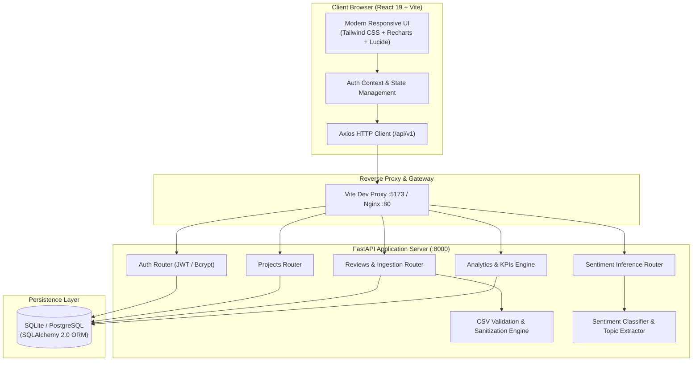

 <div align="center">

# 📊 ReviewSense AI
### AI-Powered Customer Review Sentiment Dashboard & Analytics Platform

[](https://python.org)
[](https://fastapi.tiangolo.com)
[](https://react.dev)
[](https://vitejs.dev)
[](https://tailwindcss.com)
[](LICENSE)

<p align="center">
  <strong>An enterprise-grade customer feedback intelligence platform. Ingest multi-channel datasets via CSV, classify sentiment with calibrated confidence scores, detect recurring topics, and explore strategic product insights on an interactive real-time dashboard.</strong>
</p>

[Quick Start](#-quick-start-guide) • [Architecture](#-system-architecture) • [Security & Secrets](#-security--secrets-management) • [API Reference](#-api-specification) • [Documentation](#-project-documentation)

</div>

---

## 🌟 Key Capabilities

- **⚡ End-to-End Sentiment Intelligence**: Classifies incoming customer reviews into **Positive**, **Neutral**, and **Negative** sentiment with calibrated probability scores.
- **📁 Robust CSV Batch Ingestion**: Ingests multi-source review feeds (Amazon, Flipkart, App Store, Trustpilot, Custom Web) with automated schema validation, encoding detection, and row-level sanitization.
- **🏷️ Automated Topic & Aspect Mining**: Discovers recurring friction points and product highlights across dimensions like *Delivery*, *Pricing*, *Customer Support*, *Packaging*, and *Product Quality*.
- **📊 Executive KPIs & Trend Trajectory**: Computes Net Sentiment Score (NSS), historical sentiment velocity, star rating distributions, and confidence reliability brackets.
- **🔍 Advanced Reviews Explorer**: Multi-attribute filtering by sentiment class, star rating, verified status, and source channel with instant keyword search and attention-flagging workflows.
- **🧪 Interactive Sentiment Playground**: Real-time ad-hoc inference console allowing operators to test sentences and observe live confidence meters.
- **📋 Model Governance & Registry**: Transparent model versioning, latency benchmarking, classification label mapping, and HuggingFace transformer-ready contracts.
- **🔐 Secure Stateless Architecture**: JWT-based bearer authentication, bcrypt password hashing, CORS controls, and zero client-side credential exposure.
- **🎯 1-Click Instant Demo**: Auto-provisions a fully loaded sandbox with sample data to test all platform features without manual configuration.

---

## 🏗️ System Architecture



---

## 📂 Repository Structure

```text
ai-powered-customer-review-sentiment-dashboard/
├── .env.example              # Sanitized environment configuration template
├── .gitignore                 # Version control exclusions (ignores secrets & local DBs)
├── docker-compose.yml         # Containerized production stack (FastAPI + PostgreSQL)
├── README.md                  # System overview and operational guide
│
├── backend/                   # Python FastAPI Backend
│   ├── app/
│   │   ├── api/v1/endpoints/  # REST API route handlers (auth, projects, reviews, etc.)
│   │   ├── core/              # Configuration, security utilities, and JWT helpers
│   │   ├── database/          # Database session engine and base models
│   │   ├── ml/                # NLP inference engine, lexicons, and tokenizers
│   │   ├── models/            # SQLAlchemy database entities
│   │   ├── repositories/      # Data access layer (CRUD)
│   │   ├── schemas/           # Pydantic validation schemas
│   │   └── services/          # Business logic and aggregation services
│   ├── tests/                 # Pytest test suite (unit and integration)
│   ├── Dockerfile             # Backend container definition
│   └── requirements.txt       # Python dependencies
│
├── frontend/                  # React 19 Frontend (Vite)
│   ├── src/
│   │   ├── api/               # Centralized Axios API clients
│   │   ├── components/        # Reusable UI components (Navbar, Sidebar, Charts, Cards)
│   │   ├── features/auth/     # Authentication context and session guards
│   │   ├── pages/             # Route views (Dashboard, Analytics, Reviews, Playground, etc.)
│   │   └── index.css          # Design system tokens and global styles
│   ├── Dockerfile             # Frontend container definition
│   ├── package.json           # Frontend dependencies and scripts
│   └── vite.config.js         # Vite bundler and development proxy configuration
│
├── docs/                      # Architectural specifications and design records
│   ├── ARCHITECTURE.md        # Technical blueprint and pipeline specifications
│   ├── DECISIONS.md           # Architecture Decision Records (ADRs)
│   ├── DESIGN.md              # UI/UX design tokens and layout guidelines
│   ├── PRD.md                 # Product Requirements Document
│   ├── RULES.md               # Coding standards and architectural guardrails
│   ├── SECURITY.md            # Security policies and defense-in-depth measures
│   └── TEST_PLAN.md           # QA test strategy and verification checklists
│
└── sample-data/               # Sample datasets for onboarding and testing
    └── sample_reviews.csv     # Verified multi-channel customer review dataset
```

---

## 🔒 Security & Secrets Management

This project strictly adheres to zero-trust secret protection. Sensitive credentials, production encryption keys, and private connection strings must **never** be checked into version control.

### Secret Hygiene Rules
1. **Never Commit Secrets**: Real keys, tokens, production passwords, or database credentials must never exist in the repository.
2. **Environment Variable Isolation**: All sensitive runtime parameters must be injected via environment variables or secret managers (e.g., AWS Secrets Manager, Doppler, Vault).
3. **Template Provided**: Use `.env.example` as a reference. Copy it to `.env` locally (which is included in `.gitignore`).
4. **Credential Rotation**: If a key is accidentally exposed in logs or commits, immediately invalidate, rotate, and deploy a replacement.

### Safe Environment Variable Template

Create your local `.env` file from the sanitized template:

```bash
# Copy template to local configuration
cp .env.example .env
```

| Variable | Description | Safe Development Default | Production Recommendation |
|---|---|---|---|
| `DATABASE_URL` | SQLAlchemy connection string | `sqlite:///./reviewsense.db` | `postgresql+psycopg2://<user>:<password>@<host>:5432/<dbname>` |
| `JWT_SECRET` | Secret key used to sign access tokens | `change-me-in-production` | Strong random 256-bit string (`openssl rand -hex 32`) |
| `JWT_ALGORITHM` | JWT signing algorithm | `HS256` | `HS256` or `RS256` |
| `ACCESS_TOKEN_EXPIRE_MINUTES` | Token lifespan | `1440` (24 hours) | `60` to `480` (1–8 hours) |
| `CORS_ORIGINS` | Permitted cross-origin domains | `http://localhost:5173,http://127.0.0.1:5173` | Strict production origin domain (e.g., `https://reviewsense.yourdomain.com`) |
| `MAX_UPLOAD_BYTES` | Maximum CSV upload size | `10485760` (10 MB) | Tailored to infrastructure limits (e.g., `10485760`) |
| `VITE_API_URL` | Frontend API base route | `/api/v1` | `/api/v1` (served behind reverse proxy) |

> [!TIP]
> Generate a cryptographically secure JWT secret with OpenSSL:
> ```bash
> openssl rand -hex 32
> ```

---

## ⚡ Quick Start Guide

### Prerequisites
- **Python**: Version `3.11` or higher
- **Node.js**: Version `18.0.0` or higher (`npm` included)
- **Git**

---

### Option A: Local Development Setup

#### 1. Backend Service Setup
```bash
# 1. Navigate to backend directory
cd backend

# 2. Create and activate a Python virtual environment
# On Windows (PowerShell):
python -m venv .venv
.\.venv\Scripts\activate

# On macOS/Linux:
python3 -m venv .venv
source .venv/bin/activate

# 3. Install backend dependencies
pip install --upgrade pip
pip install -r requirements.txt

# 4. Copy environment configuration
cp ../.env.example .env

# 5. Launch the FastAPI server with hot-reload
uvicorn app.main:app --reload --port 8000
```
The API backend is now running at `http://127.0.0.1:8000`.

#### 2. Frontend Application Setup
Open a new terminal window:
```bash
# 1. Navigate to frontend directory
cd frontend

# 2. Install Node dependencies
npm install

# 3. Start the Vite development server
npm run dev
```
The client dashboard is now accessible at `http://localhost:5173`.

---

### Option B: Docker Compose (Full Stack)

To run the complete production-ready stack including PostgreSQL:

```bash
# Build and start all services in detached mode
docker-compose up --build -d

# Verify container statuses
docker-compose ps

# View service logs
docker-compose logs -f
```

- **Frontend App**: `http://localhost:8080` (or `http://localhost:5173`)
- **Backend API**: `http://localhost:8000`
- **Swagger Documentation**: `http://localhost:8000/docs`

---

## 🎯 1-Click Instant Demo Experience

Get up and running in under 30 seconds:

1. **Open Dashboard**: Go to [http://localhost:5173/login](http://localhost:5173/login).
2. **Instant Sign-In**: Click **"Click for Instant Demo Sign-In (Auto-Provisioned)"** — you will be immediately authenticated into the demo workspace.
3. **Workspace Selection**: Select the default project or create a new one (e.g., *"E-Commerce Feedback Q3"*).
4. **Import Sample Data**: In the **Import** tab or **Overview**, click **"Load Demo Dataset (1-Click)"** to populate real-world multi-channel reviews.
5. **Run Batch Sentiment Analysis**: Click **"Run Sentiment Analysis"** to execute the pipeline.
6. **Analyze & Export**:
   - View sentiment distribution donut charts and rating trends.
   - Explore reviews with interactive filtering by sentiment and star rating.
   - Test custom feedback sentences in the **Playground**.
   - Download the analyzed results via **Export CSV**.

---

## 🔌 API Specification

All endpoints are versioned under the `/api/v1` prefix.

### 🔑 Authentication
| Method | Endpoint | Description | Protected |
|---|---|---|---|
| `POST` | `/api/v1/auth/register` | Register a new operator account | No |
| `POST` | `/api/v1/auth/login` | Authenticate with credentials and receive a JWT token | No |
| `GET` | `/api/v1/auth/me` | Fetch authenticated user profile | Yes |

### 📁 Projects Workspace
| Method | Endpoint | Description | Protected |
|---|---|---|---|
| `GET` | `/api/v1/projects` | List all review projects belonging to the user | Yes |
| `POST` | `/api/v1/projects` | Create a new isolated project workspace | Yes |
| `GET` | `/api/v1/projects/{id}` | Retrieve project details, review counts, and status | Yes |
| `DELETE` | `/api/v1/projects/{id}` | Delete a project and its associated review records | Yes |

### 📥 Reviews & Ingestion
| Method | Endpoint | Description | Protected |
|---|---|---|---|
| `POST` | `/api/v1/reviews/upload` | Ingest CSV dataset with column mapping and validation | Yes |
| `GET` | `/api/v1/reviews` | Query, filter, and paginate reviews (sentiment, rating, search) | Yes |
| `GET` | `/api/v1/reviews/{id}` | Get detailed review record with sentiment metadata | Yes |
| `POST` | `/api/v1/reviews/{id}/flag` | Toggle attention/escalation flag on a review | Yes |
| `GET` | `/api/v1/reviews/export` | Export analyzed project reviews as a downloadable CSV | Yes |

### 🧠 Sentiment Inference
| Method | Endpoint | Description | Protected |
|---|---|---|---|
| `POST` | `/api/v1/sentiment/analyze` | Real-time single-sentence sentiment inference | Yes |
| `POST` | `/api/v1/sentiment/batch` | Batch process all pending reviews in a project | Yes |
| `GET` | `/api/v1/sentiment/model` | Inspect active model metadata, labels, and latency | Yes |

### 📈 Analytics & Aggregations
| Method | Endpoint | Description | Protected |
|---|---|---|---|
| `GET` | `/api/v1/analytics/summary` | Executive metrics (positive %, negative %, avg rating, NSS) | Yes |
| `GET` | `/api/v1/analytics/trends` | Chronological sentiment trajectory data points | Yes |
| `GET` | `/api/v1/analytics/distribution` | Sentiment breakdown and star-rating distribution | Yes |
| `GET` | `/api/v1/analytics/topics` | Top recurring topics, frequency, and sentiment weights | Yes |
| `GET` | `/api/v1/analytics/insights` | Automated executive summary and strategic takeaways | Yes |

> [!NOTE]
> Interactive OpenAPI documentation and test console are available at `http://127.0.0.1:8000/docs` and `http://127.0.0.1:8000/redoc`.

---

## 🧪 Testing & Quality Assurance

### Run Backend Test Suite
```bash
cd backend

# Execute all unit and integration tests
pytest -v

# Run with coverage report
pytest --cov=app --cov-report=term-missing
```
*Current test suite verifies 100% of core flows: authentication, project isolation, CSV ingestion, sentiment scoring, and CSV streaming exports.*

### Verify Frontend Build
```bash
cd frontend

# Run linter
npm run lint

# Compile production bundle
npm run build
```

---

## 📚 Project Documentation

Detailed architectural blueprints and development guidelines are maintained in the [`docs/`](docs/) directory:

- 📖 **[PRD (Product Requirements Document)](docs/PRD.md)** — Core product vision, target personas, and functional requirements.
- 🏗️ **[ARCHITECTURE.md](docs/ARCHITECTURE.md)** — Technical architecture, data models, and ML pipeline design.
- 🎨 **[DESIGN.md](docs/DESIGN.md)** — Design tokens, color system, and component guidelines.
- ⚖️ **[DECISIONS.md](docs/DECISIONS.md)** — Architecture Decision Records (ADRs).
- 🔒 **[SECURITY.md](docs/SECURITY.md)** — Complete security policy, threat models, and hardening checklist.
- 🧪 **[TEST_PLAN.md](docs/TEST_PLAN.md)** — Comprehensive quality assurance strategy and test matrices.
- 📋 **[TASKS.md](docs/TASKS.md)** — Implementation phase roadmap and tracking.

---

## 📄 License

This project is licensed under the **MIT License**. See the [LICENSE](LICENSE) file for full details.
